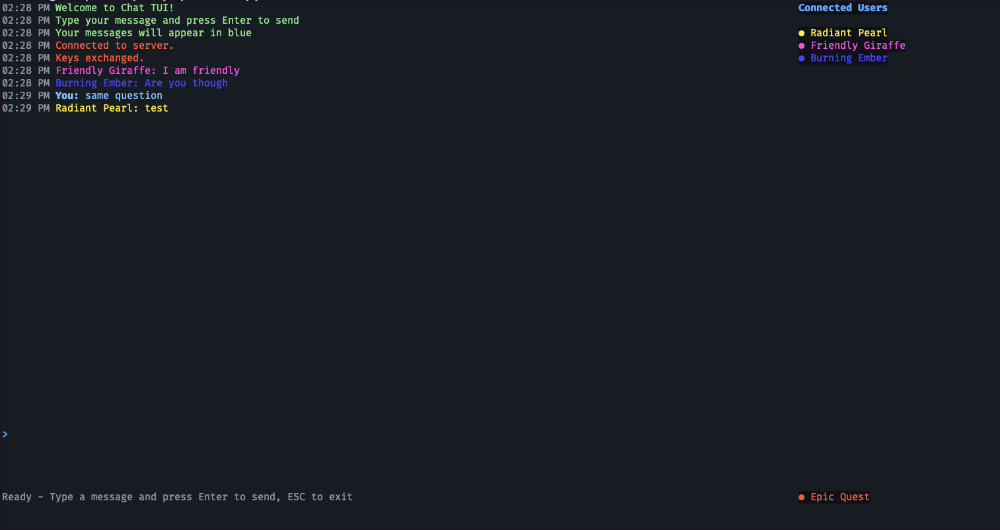
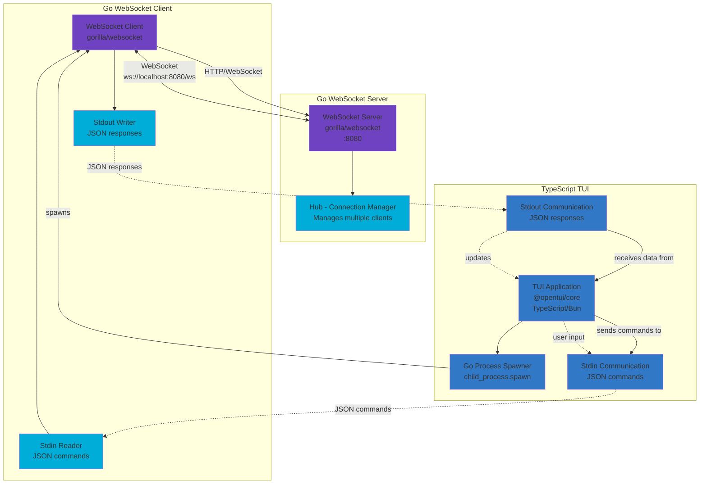

# PQC



Just a simple way of working with Post-Quantum Cryptography (PQC) in Go. Also makes use of OpenTUI to create, well, a TUI.

Disclaimer: not much thought was put into selecting the configurations/algorithms for these. Use at your own peril.

## Development

### Installing

You need Go and Bun installed.

```sh
cd core/ && go mod tidy
```

```sh
cd tui/ && bun i
```

### Running

In one terminal, start the WS server:

```sh
# With `just`
just start-server
# Manually
cd core/
go run ./cmd/server
```

In another terminal(s), start the client(s) with the TUI:

```sh
# With `just`
just start-tui
# Manually
# First build the go code:
cd core && go build ./cmd/client
# Now run the tui
cd tui && bun run dev
```

> [!TIP]
> You can use multiple clients and just one server. The server will handle the data encryption from one client to another and will fanout the information to all connected clients, as if every client is connected to the same big room.

## Architecture



**Architecture Overview:**

- **WebSocket Server (Go)**: Hub managing multiple client connections using gorilla/websocket
- **WebSocket Client (Go)**: Connects to server via HTTP/WebSocket, reads JSON commands from stdin, writes responses to stdout  
- **TUI (TypeScript)**: Uses @opentui/core, spawns Go process, communicates via stdin/stdout with JSON messages

**Key Technologies:**
- Go + gorilla/websocket for server/client
- TypeScript + @opentui core for TUI
- JSON communication between TUI and Go client
- WebSocket protocol for real-time messaging

## TUI

### Commands

- `/quit`, `/exit`, `/q`, `:wq`, `:q`, `:wqa`: quits the TUI.

## Cryptography

### Explanation

1) First step: exchange keys using ML-KEM (post quantum cryptography);

2) Second step: make the shared key usable and more secure with KDF (Key Derivation Function);

3) Third step: use the key from KDF (improved shared key), to encrypt the message using some symmetric-key algorithm;

4) Fourth step: transmit the encrypted message;

5) Fifth step: on the other side, decrypt the message using the same symmetric-key algorithm.


#### Key exchange

The process of key exchange is made using the post-quantum cryptography [ML-KEM](https://pkg.go.dev/crypto/mlkem).
This process can be described between two parties (Alice and Bob) as:

- Alice, the person initiating the request, first generates a pair of keys: one public ("encapsulationKey") and one private ("decapsulation key");
- Alice then sends the public key to Bob in bytes format over the wire;
- Bob in the `keyExchange` gets the public key from that array of bytes and generates a ciphertext and a shared key ("sharedSecret") from it along with some random bytes from `crypto/rand`. This "sharedSecret" MUST stay private;
- Bob returns to Alice the ciphertext;
- Alice uses its own private key (the decapsulation key) to get the shared key ("sharedSecret") from that ciphertext;
- Now both Alice and Bob have the same shared key ("sharedSecret") without ever sharing that over the wire, only sharing public information (the public key - a.k.a "encapsulationKey" - and the ciphertext).

#### KDF

Using a key derivation function (KDF) improves the security of the shared secret by making it more uniform, adequating its size to be used to other symmetric functions and removing possible characteristics that could make it easier for an attacker to try toguess it.

We are using [HKDF](https://pkg.go.dev/golang.org/x/crypto/hkdf).

#### Symmetric-key cryptography

Because each party has its own secret key, we can know use a faster and still secure way of encrypting data. We are using [ChaCha20Poly1305](https://pkg.go.dev/golang.org/x/crypto/chacha20poly1305), which is considered post-quantum secure.

